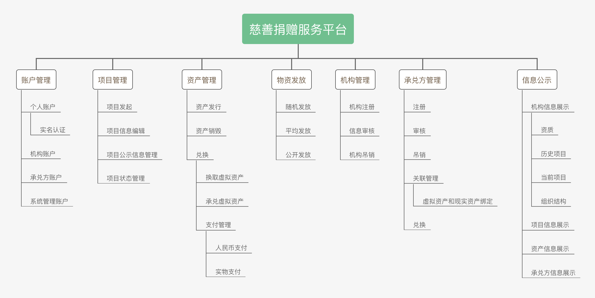
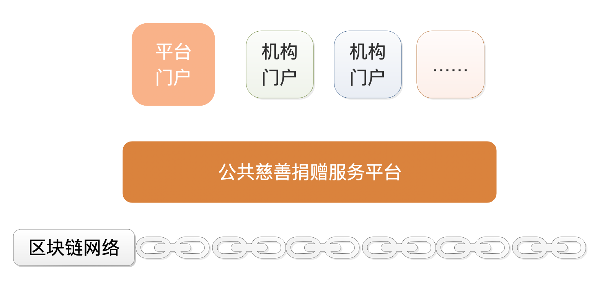
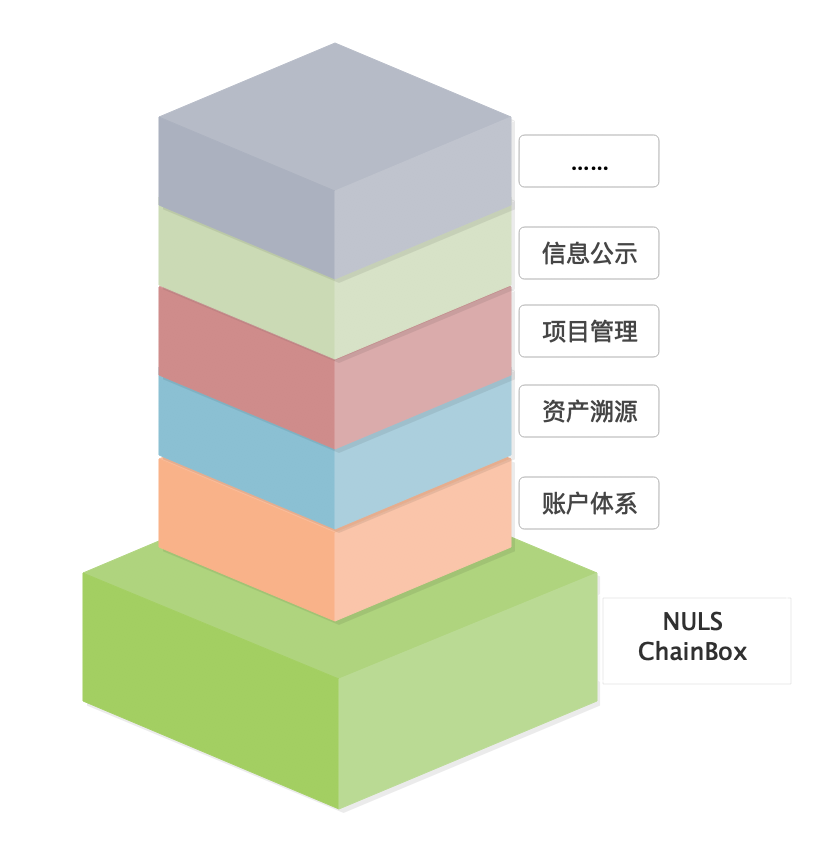

# 公共慈善捐赠服务平台
# **背景**
新型冠状病毒疫情爆发，武汉红十字会被暂停工作。天灾引出人祸，人祸加重天灾。

慈善机构公信力不足，挪用、贪污捐款的事情时有发生。捐赠者往往会因为对机构的不信任，放弃了自己的捐赠计划。

区块链可以实现信任的传递，解决慈善机构公信力不足的问题，解决捐款捐物公开透明度不够的问题，解决慈善款项、物品溯源、物资公平发放等问题。

# **平台介绍**
公共慈善服务平台是一个开放的平台，提供慈善项目的发起、管理、跟踪溯源、监管、公示等功能。平台以虚拟资产作为媒介，由承兑方进行虚拟资产到人民币、财务的承兑。每个慈善机构都可以在完成企业（单位）认证后，在平台上发起项目、设置虚拟资产承兑人。捐赠人可以购买或以其他方式获取虚拟资产，捐赠给项目，并随时查看项目进度、捐赠进度。被捐赠人可以在平台上领取捐赠的虚拟资产，在资产承兑人处进行资产兑换。

我们希望建成一个全国性的慈善捐赠服务平台，所有的慈善机构都可以在平台中发布项目，吸纳参与者，捐款捐物，壮大中国慈善事业。所有人都可以在平台中注册用户，参与慈善项目、监督慈善项目进程、跟踪溯源每一笔捐赠的处理。

# **角色设计**
公共慈善捐赠服务平台服务于慈善机构、捐赠人（单位）、资金承兑方、被捐赠人（单位）。

慈善机构：可以在平台中发起项目，公示计划、方案。

捐赠者：可以在平台中进行捐赠

被捐赠人：接受捐赠的人或集体

资金承兑方：拥有公信力和资金实力的单位，可以是政府、银行、大企业等

# **功能设计**

## 账户管理
平台管理四种账户

* 个人账户：支持实名认证，成功后生成私钥，由用户备份。可以参与慈善项目、管理资产等。个人信息加密后上链存储，持有账户私钥随时可以进行更改。
* 机构账户：机构注册成功后，生成机构账户，用于管理项目，更新项目进度，登记资金使用情况等信息，所有登记信息上链，记录每次信息更新记录，用于数据公示。
* 承兑方账户：主要负责资产发行、管理、承兑，所有信息上链运行。
* 管理员账户：用于管理系统功能、授权等。

私钥安全管理机制：

对个人用户用户，要求使用密码对私钥进行备份，备份后上传云端存储。

对机构用户和承兑方用户，可以进行私钥保存方式的选择，1、使用个人用户的方式，加密后上传云端；2、使用硬件钱包的方式，备份多个私钥，系统中不对私钥进行存储备份，每次使用需要连接硬件钱包。

## 项目管理
慈善机构可以发起不同类型的慈善项目，项目经过审批后将公示。

项目中可以进行状态变更，进度信息填写，相关公示信息填写。

个人用户可以选择项目，查看详情，参与项目，捐款、捐物、参与运营执行。

## 资产管理
承兑方可以发行资产，资产分为两种类型的资产：

* 同质资产
  * 发行等价资产：用于管理捐赠、财务支出等，用于记录所有交易记录，承兑方负责资产的兑换。
* 非同质资产：捐赠的无聊，参与的人力资源等，每个资产都需要做资产的绑定，最终在溯源信息中体现。

平台官方合作政府、银行或大企业，发行等价资产，该资产接受随时充值和提现，供所有项目使用。

### 物资发放
从厦门通过APP摇号进行口罩发放得到经验，通过区块链的公平公开特性，保证物资发放的公平、公正、公开。

在应急事件处理中，提供一个物资公平的发放途径，有益于解决民众的恐慌、抑制不法者的投机行为。

* 随机发放：摇号购买、摇号赠送等
* 公平发放：核实身份信息，平均发放物资，公开所有信息。
* 公开发放：定制发放细节，公布所有信息。
## 机构管理
机构的注册、审核、认证、吊销功能；机构账户的管理；硬件私钥的申请、发放、管理；机构公示信息管理；

机构信息登记上链，每次信息变更都会留存变更记录。

## 承兑方管理
承兑方的注册、审核、认证、吊销功能；承兑方账户的管理；硬件私钥的申请、发放、管理；机构公示信息管理；

承兑方信息登记上链，每次信息变更都会留存变更记录。

## 信息公示
信息的增删改查：每一个操作都是链上操作，用户可以查看每条消息的历史操作记录。

# 架构设计

## 总体说明
* 区块链层：基于NULS ChainBox联盟链版本搭建，支持监管，支持国密算法。用于数据上链、资产管理、信息溯源等。NULS ChainBox是开源的区块链运行环境，可以方便的在区块链上进行业务扩展，忽略区块链中数学算法、共识机制、P2P网络等技术难点，降低区块链应用的开发门槛。
* 平台层：负责业务逻辑的实现、与区块链的对接、业务数据的存储、与其他硬件的对接、开放接口服务（提供给网页和手机端应用）。
* 应用层：提供桌面应用、网页、手机app、小程序等直接的应用，提供给机构、承兑方和个人用户使用。
## 区块链层
区块链节点程序基于开源区块链可运行环境实现，在区块链基础层之上，集成慈善捐赠服务平台的业务支持，增加慈善捐赠服务的独特协议。

* 共识算法：支持监管的联盟链策略，所有联盟成员一起决定新成员的加入和老成员的踢出。
* 组网方式：网络层存在双层网络：联盟节点网络和整体P2P网络
* 数学算法：全面支持国密算法SM1/SM2/SM3
## 平台层
采用微服务设计的常规互联网应用平台，底层对接区块链，保证核心业务数据的上链存储，顶层提供开放API服务，供用户端应用调用。

慈善捐赠平台的所有业务功能都在平台层完成。

## 应用层
* 手机APP
* 网页界面
* 桌面应用（Windows/macOS/Linux）
* 小程序（支付宝/微信/……）

